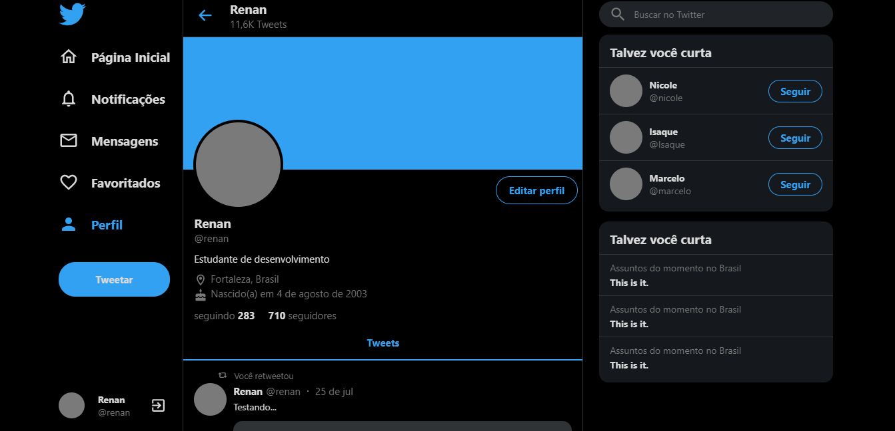
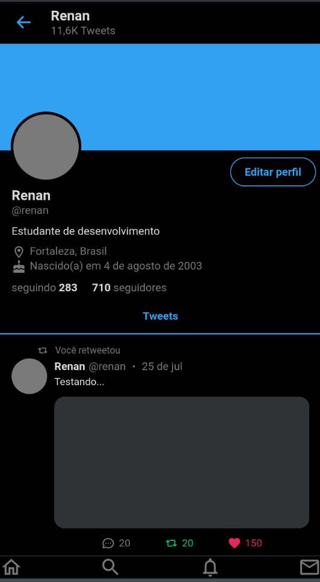

## twitter-clone
Um clone do Twitter feito em ReactJS. Projeto resultado de um UI Clone da [Rocketseat](https://youtu.be/K-8z_4xvT3o).

### Como rodar o app na sua máquina 

`npm start`

Roda o app em modo de desenvolvedor. 
Abra [http://localhost:3000](http://localhost:3000) para ver no seu navegador.

### Link para ver o resultado:
[https://r3nanp-twitter-clone.netlify.app/](https://r3nanp-twitter-clone.netlify.app/) 

### Screenshot

